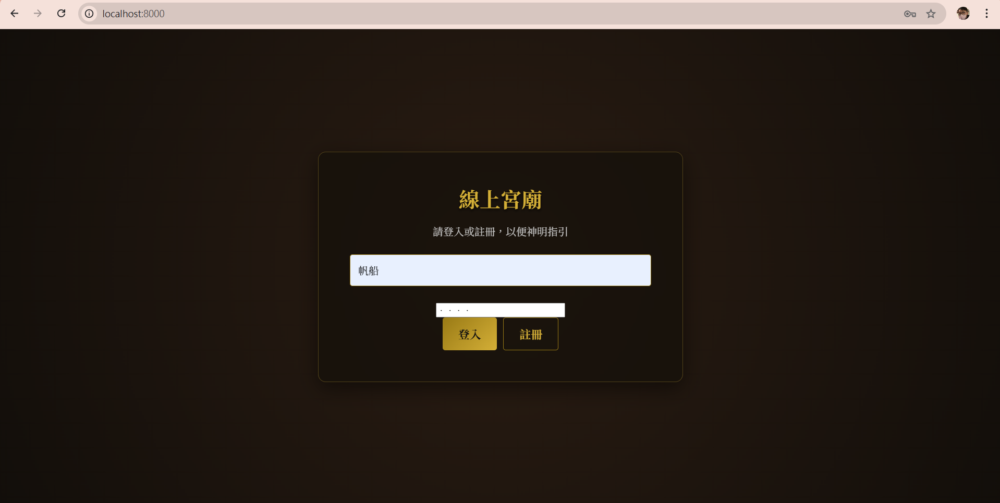
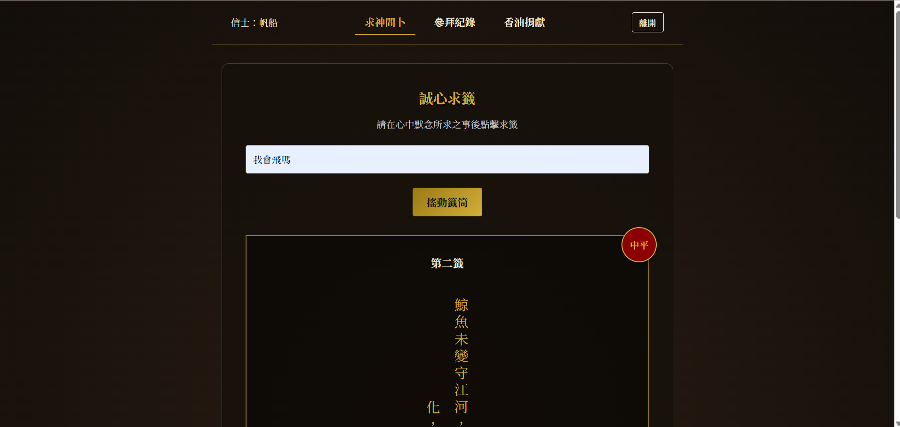
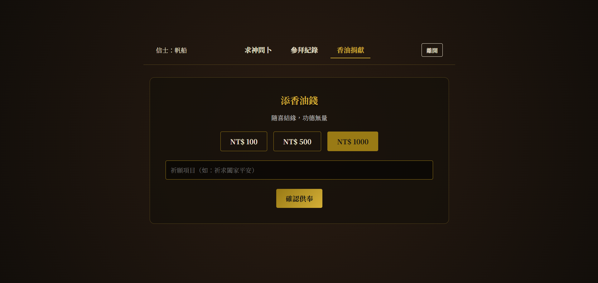
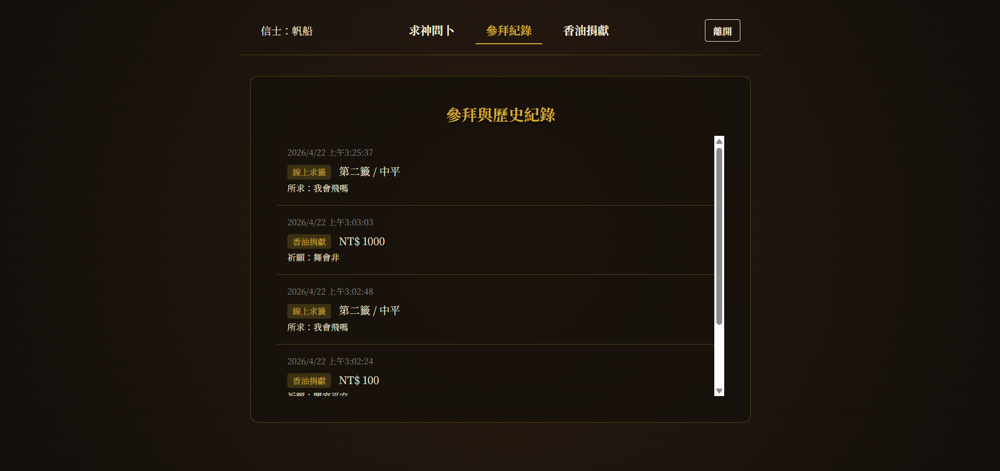

# 作業：設計 Skill + 打造宮廟抽籤系統

> **繳交方式**：將你的 GitHub repo 網址貼到作業繳交區
> **作業性質**：個人作業

---

## 作業目標

使用 Antigravity Skill 引導 AI，完成一個具備前後端的「線上宮廟抽籤與捐獻系統」。
重點不只是「讓程式跑起來」，而是透過設計 Skill，學會用結構化的方式與 AI 協作開發。

---

## 繳交項目

你的 GitHub repo 需要包含以下內容：

### 1. Skill 設計（`.agents/skills/`）

為以下五個開發階段＋提交方式各設計一個 SKILL.md：

| 資料夾名稱        | 對應指令          | 說明                                                                           |
| ----------------- | ----------------- | ------------------------------------------------------------------------------ |
| `prd/`          | `/prd`          | 產出 `docs/PRD.md`                                                           |
| `architecture/` | `/architecture` | 產出 `docs/ARCHITECTURE.md`                                                  |
| `models/`       | `/models`       | 產出 `docs/MODELS.md`                                                        |
| `implement/`    | `/implement`    | 產出程式碼（使用 HTML 前端 + FastAPI + SQLite 後端）              |
| `test/`         | `/test`         | 產出手動測試清單 `docs/TEST_CASES.md`                                          |
| `commit/`       | `/commit`       | 自動 commit + push（使用者名稱設定為 Antigravity） |

### 2. 開發文件（`docs/`）

用你設計的 Skill 產出的文件，需包含：

- `docs/PRD.md`
- `docs/ARCHITECTURE.md`
- `docs/MODELS.md`
- `docs/TEST_CASES.md`

### 3. 程式碼

一個可執行的線上宮廟系統，需支援以下功能：

| 功能           | 說明                                       | 是否完成 |
| -------------- | ------------------------------------------ | -------- |
| 註冊與登入功能 | 支援使用者註冊帳號並以密碼雜湊登入 | O |
| 求神問卜       | 提供誠心默念並隨機搖出籤詩（吉凶與解析） | O |
| 歷史參拜紀錄   | 紀錄過去抽過的籤詩與內容 | O |
| 添香油錢功能   | 模擬發心捐款並紀錄虛擬金額與願望 | O |
| 前端 UI 介面   | 使用符合傳統信仰氛圍的東方暗黑 Glassmorphism 風格設計 | O |

### 4. 系統截圖

下方為宮廟抽籤系統的實際運行截圖：

- **登入與註冊介面 (Login)**
  <br>

- **求神問卜畫面 (Draw)**
  <br>

- **香油錢捐獻 (Money)**
  <br>

- **參拜歷史紀錄 (History)**
  <br>

### 5. 心得報告（本 README.md 下方）

在本 README 的**心得報告**區填寫。

---

## 專案結構範例

```
your-repo/
├── .agents/
│   └── skills/
│       ├── prd/SKILL.md
│       ├── architecture/SKILL.md
│       ├── models/SKILL.md
│       ├── implement/SKILL.md
│       ├── test/SKILL.md
│       └── commit/SKILL.md
├── backend/
│   ├── routers/
│   │   ├── auth.py
│   │   ├── donation.py
│   │   └── draw.py
│   ├── database.py
│   ├── main.py
│   ├── models.py
│   ├── schemas.py
│   └── seed.py
├── docs/
│   ├── PRD.md
│   ├── ARCHITECTURE.md
│   ├── MODELS.md
│   └── TEST_CASES.md
├── frontend/
│   ├── css/style.css
│   ├── js/app.js
│   └── index.html
├── data/
│   └── temple.db
├── requirements.txt
└── README.md          ← 本檔案（含心得報告）
```

---

## 啟動方式

```bash
# 1. 建立虛擬環境 (可選)
python3 -m venv .venv
source .venv/bin/activate   # Windows: .venv\Scripts\activate

# 2. 安裝套件
pip install -r requirements.txt

# 3. 初始化資料庫與預設籤詩
python backend/seed.py

# 4. 啟動伺服器
uvicorn backend.main:app --reload

# 開啟瀏覽器：http://localhost:8000
```

---

## 心得報告

**姓名**：薛帆凱
**學號**：D1150313

### 問題與反思

**Q1. 你設計的哪一個 Skill 效果最好？為什麼？哪一個效果最差？你認為原因是什麼？**

> implement的效果最好，因為它寫出來的程式碼都很符合我想要的

---

**Q2. 在用 AI 產生程式碼的過程中，你遇到什麼問題是 AI 沒辦法自己解決、需要你介入處理的？**

> 我要做甚麼專案是他想不到的
